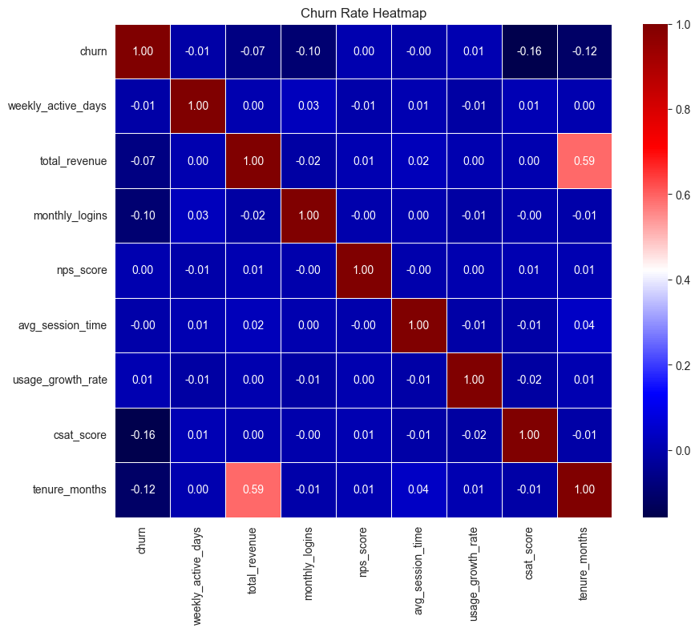
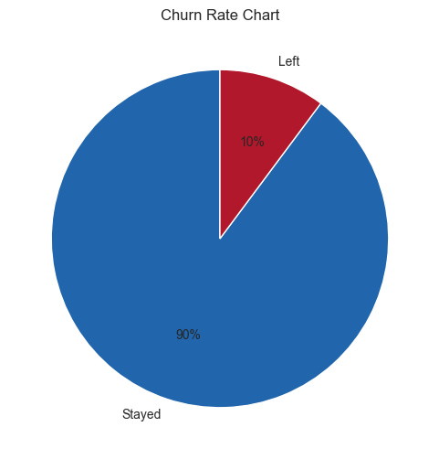

# Customer Retention Intelligence
### Predict. Analyze. Retain.

 

  <b>An end-to-end Data Science project focusing on reducing customer churn.</b> 
  From cleaning messy data with Regex to building Machine Learning models and actionable Power BI dashboards.

[View Notebook](notebooks/customer_churn.ipynb) 

---

## Business Problem
In the subscription-based economy, acquiring a new customer is **5-25x more expensive** than retaining an existing one. 

**The Goal:** Build a predictive system to identify customers at high risk of churning (`Churn=1`) and understand the key drivers behind their decision.

**Key Questions:**
* Which customers are leaving and why?
* How does customer support interaction (tickets, CSAT) impact loyalty?
* What is the financial impact of potential churn?

---

## Project Workflow

| Step | Description | Tools Used |
| :--- | :--- | :--- |
| **1. Data Cleaning** | Advanced cleaning using **Regex** to validate numerical columns (removing typos, negative values). | `Pandas`, `Re` |
| **2. EDA** | Exploratory Data Analysis to find correlations (e.g., Contract Type vs. Churn). | `Seaborn`, `Matplotlib` |
| **3. Modeling** | Building a **Random Forest** classifier to predict churn probability. | `Scikit-Learn` |
| **4. Evaluation** | Assessing model performance using Recall (to minimize false negatives) and Feature Importance. | `Confusion Matrix`, `SHAP` |
| **5. Dashboarding** | Interactive dashboard for stakeholders to filter "High Risk" customers. | `Power BI` |

---

## Key Insights & Visualizations

### 1. Correlation Analysis
*We discovered that `Payment Failures` and `Support Tickets` are the strongest predictors of churn, while high `CSAT Scores` significantly reduce the risk.*

  

### 2. Churn Distribution
*Approximately 20% of the customer base churned. The imbalance was handled using class weighting in the model.*

  

---
